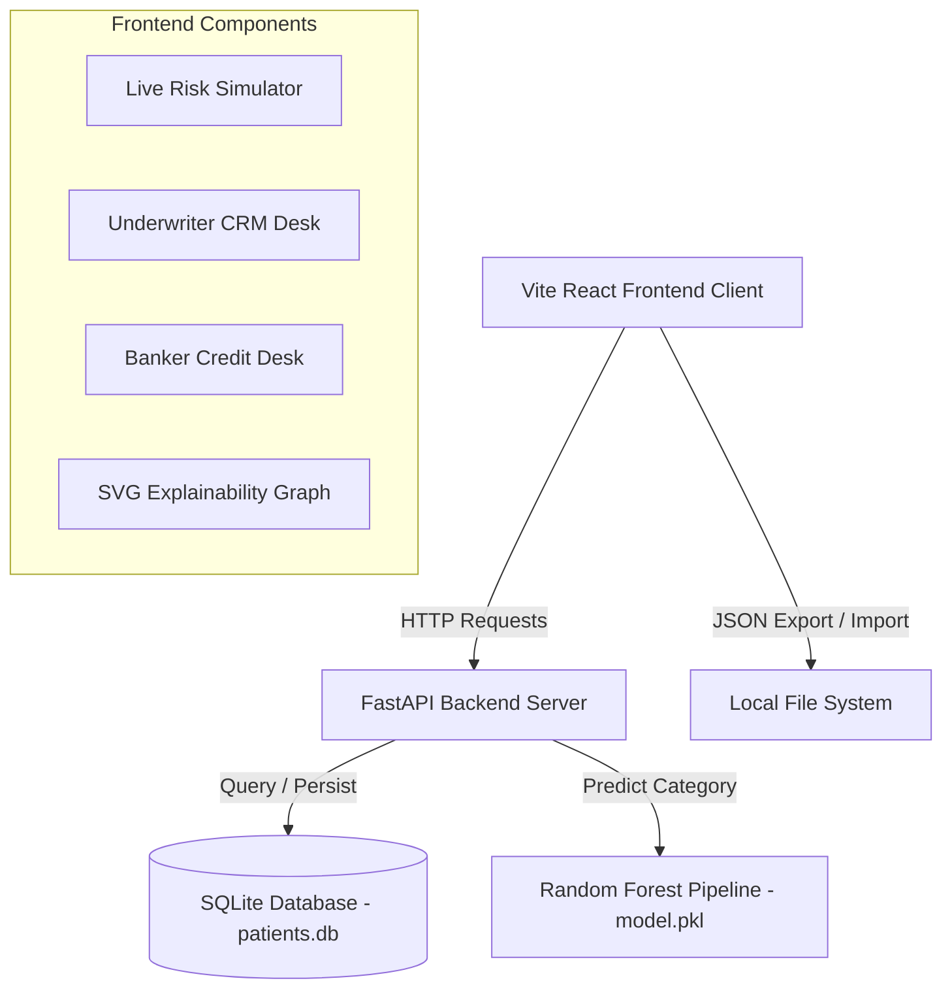

# 🏛️ Aura Actuarial Bank Suite

[](https://python.org)
[](https://fastapi.tiangolo.com)
[](https://react.dev)
[](https://tailwindcss.com)
[](https://sqlite.org)
[](https://scikit-learn.org)

An **AI-native, dark-themed actuarial workstation** that bridges the traditional gap between **Underwriting Health Statistics** and **Banking Credit Desk Risks**. 

By feeding biometric health indicators (Age, BMI, Smoking status) into a Random Forest machine learning classifier, the platform dynamically hedges banking loan default exposure, calculates credit serviceability (DTI/EMI), and simulates portfolio macroeconomic shock scenarios.

---

## ❓ Rationale: Why This Platform is Required

Traditionally, banks and insurance companies operate in separate silos. However, when a financial institution issues a large personal loan or mortgage, the **borrower’s physical health directly correlates with repayment default rates**. 

The **Aura Actuarial Bank Suite** integrates these domains:
1. **Dynamic Risk-Hedging**: Predicts a customer's health category class (`Low`, `Medium`, or `High` risk) and calculates premium financing.
2. **Actuarial Markups**: Converts health risks into lending surcharges (+1.50% to +3.00% APR APR), hedging default probability.
3. **Macro Portfolio Stress Testing**: Simulates demographics aging, weight shocks, or smoking epidemics across the database to stress-test bank solvency.

---

## 🏗️ System Architecture



---

## ⚡ Core Engine Features

### 🔒 1. Administrator Authentication Gate
Secure glassmorphic access gate protecting sensitive patient registry databases.
* **Default credentials**: `admin` / `aura2026`

### 📊 2. SQLite Database Registry & Underwriter CRM
A persistent relational storage system replacing local flat JSON files:
* Register new patient biometrics.
* Sort records dynamically by BMI, Income, Age, or Height.
* Connects seamlessly with `/import` and `/export` JSON file operations.

### 🏛️ 3. Banker Credit Desk
Evaluate lending risk by combining financial and physical statistics:
* Input requested loan values and credit scores (300-850).
* Calculates **Debt-to-Income (DTI)** ratio.
* Generates 60-month loan amortization (EMI) logs.
* Adjusts interest rates with credit rating markups and medical loading surcharges.

### 🎛️ 4. Real-Time Biometric Risk Simulator
Slide parameters (Weight, Height, Age, Income) and see premium tiers, APR markups, and EMI plans update instantly.

### 🔍 5. Interactive SVG Explainability Widget
A custom graphic depicting the mathematical feature weights of your inputs. Users can click any bar (e.g. Smoker, BMI, Income) to view the rationale behind why it is used in calculations.

---

## ⚙️ Quick Start Installation

### 1. Start the FastAPI API Server
Activate your local virtual environment and start the uvicorn process on port `8000`:
```bash
# Activate Virtual Environment
myenv\Scripts\activate

# Install Dependencies
pip install -r requirements.txt

# Launch Server
uvicorn app:app --port 8000 --host 127.0.0.1
```

### 2. Start the React Frontend Client
Navigate to the frontend directory, install npm modules, and run the development compiler:
```bash
cd frontend
npm install
npm run dev
```
Open **[http://localhost:5173/](http://localhost:5173/)** to launch the Actuarial console.
